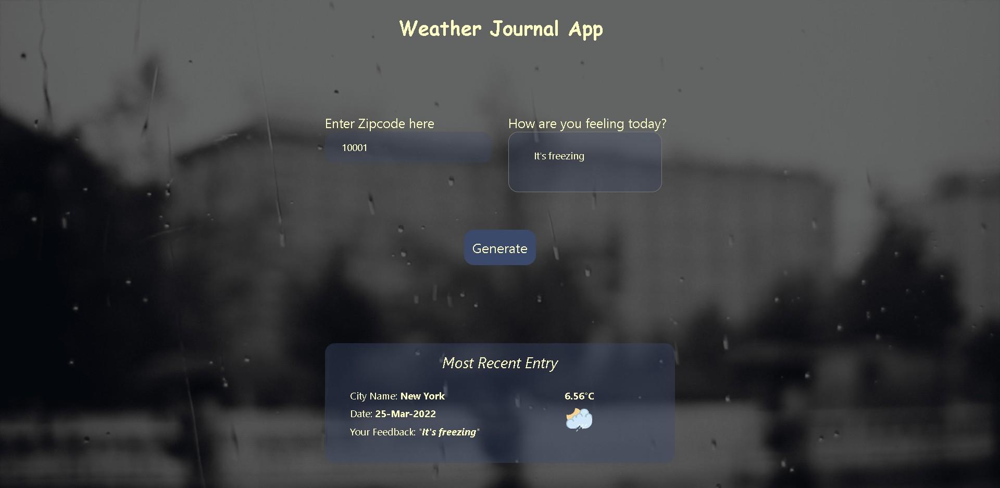

# fwd-weather-journal

Udacity-FWD Project

# Weather-Journal App Project

## Overview

Weather Journal App with Asynchronous JavaScript that uses Web API and user data to dynamically update the UI.

## Table of Contents

- [Features](#Features)
- [Contact](#Contact)

### Preview Image

#### Features

<menu>
  <li>Asynchronous JavaScript</li>
  <li>Express.js Environment</li>
  <li>Server-Side Code & Client-Side Code</li>
  <li>fetch data from API, which used to dynamically update the UI.</li>
</menu>

 
 
 
🤩 Leave a :star:&nbsp;if you like it, Please!

 

#### Contact

📫 Please hit me up at mohammed.yuossry@gmail.com if you have any feedback or improvements.
